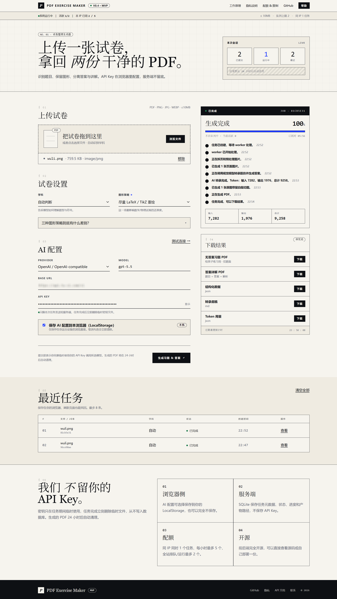

# PDF Exercise Maker Web

一个轻量单机 Web 应用：用户上传试卷图片或 PDF，填写自己的 AI API Key，生成两份可下载文件：

- 无答案习题 PDF
- 完整题目 + 答案详解 PDF

项目适合部署在低配 VPS 上，默认使用 FastAPI、SQLite、本地文件目录、单 worker 和 Nginx，不依赖 Docker、Redis 或 PostgreSQL。

## 页面预览



## 功能

- 支持上传 JPG、PNG、PDF 等试卷文件。
- OpenCV 优先做图片回正、增强和预处理。
- 支持数学公式 PDF，优先使用 XeLaTeX。
- 支持复杂图形优先原图带留白裁切，避免不规则几何图被错误重绘。
- 使用 SQLite 记录任务状态，上传文件和生成结果存放在本地 `data/`。
- 单 worker 顺序处理任务，适合 1GB 小主机。
- MVP 限制：单文件 10MB、全局 queued/running 最多 2 个、同 IP 同时最多 1 个任务、同 IP 每小时最多 5 个任务。
- 服务端任务超过 24 小时会被清理，包括上传文件、任务目录、产物文件和 SQLite 任务记录。
- 浏览器 LocalStorage 可保存最近 job_id 和用户自己的 AI 配置。
- 可选隐藏统计页记录 `page_view`、`job_created`、`artifact_download` 三类事件，方便站长了解访问和使用情况。

## 安全说明

不要把以下内容提交到 Git：

- `.env`
- `cert/` 里的 Cloudflare Origin Certificate 和私钥
- `data/`、`var/` 里的上传文件、任务数据、生成 PDF
- 真实 VPS IP、生产域名、SSH 密码、API Key

本项目的 `.gitignore` 已默认忽略这些运行时文件。公开仓库只应保存代码、模板和示例配置。

网页中的 AI Provider、Base URL、Model、API Key 默认由用户在浏览器填写。API Key 提交任务时会临时传给服务端，服务端写入任务目录里的临时 `secrets.json`，worker 读取后立即删除，不写入 SQLite。

最近任务列表保存在用户自己的浏览器 LocalStorage 中，只保存任务引用和展示用元数据。服务端 24 小时清理不会主动删除用户浏览器里的 LocalStorage；如果任务已过期，用户再次查看时会得到任务不存在或文件已清理的提示。

隐藏统计页只记录 IP、匿名浏览器 `client_id`、User-Agent、路径和任务 ID 引用，不记录 API Key、Base URL、上传文件内容、PDF 内容或答案内容。真实 `VISITOR_STATS_TOKEN` 必须只放在部署环境的 `.env`，不要提交到 Git。

## 本地运行

```bash
python3 -m venv .venv
. .venv/bin/activate
pip install -r requirements.txt
cp .env.example .env
uvicorn app.main:app --host 127.0.0.1 --port 8719
```

打开：

```text
http://127.0.0.1:8719
```

## VPS 部署

默认部署目录：

```text
/opt/pdf-exercise-web
```

基础安装：

```bash
cd /opt/pdf-exercise-web
bash deploy/install_vps.sh
```

常用环境变量：

```bash
export PDF_EXERCISE_APP_DIR=/opt/pdf-exercise-web
export PDF_EXERCISE_APP_USER=ubuntu
export PDF_EXERCISE_PUBLIC_PORT=18437
export PDF_EXERCISE_APP_PORT=8719
export PDF_EXERCISE_PUBLIC_BASE_URL=http://your-server-ip:18437
bash deploy/install_vps.sh
```

如果要使用 Cloudflare Full Strict HTTPS，需要在 VPS 上准备 Origin Certificate 和私钥，然后传入路径：

```bash
export PDF_EXERCISE_DOMAIN=pdf.example.com
export PDF_EXERCISE_PUBLIC_BASE_URL=https://pdf.example.com
export PDF_EXERCISE_ORIGIN_CERT_FILE=/root/certs/pdf.example.com.pem
export PDF_EXERCISE_ORIGIN_KEY_FILE=/root/certs/pdf.example.com.key
bash deploy/install_vps.sh
```

注意：`PDF_EXERCISE_ORIGIN_KEY_FILE` 必须是私钥文件。只有证书 `.pem` 不够，Nginx 启用 `listen 443 ssl` 必须同时拥有证书和对应私钥。

## 隐藏统计页

如果需要查看访问者记录，在 `.env` 中设置：

```bash
VISITOR_STATS_TOKEN=change-me
VISITOR_EVENT_RETENTION_DAYS=90
```

访问方式：

```text
https://your-domain.example/internal/visitors?token=change-me
```

这个入口不会出现在首页导航或页脚中。未设置 token、缺少 token 或 token 错误时都会返回 `404`，避免公开暴露统计页面。访问日志默认保留 90 天，并由清理脚本随过期任务一起清理。

## 远程部署脚本

`deploy/remote_deploy.py` 是可选的便捷脚本，会通过 SSH 上传项目并执行安装。运行前必须用环境变量传入目标 VPS 信息：

```bash
export PDF_EXERCISE_VPS_HOST=your-server-ip
export PDF_EXERCISE_VPS_PORT=22
export PDF_EXERCISE_VPS_USER=ubuntu
export PDF_EXERCISE_VPS_PASSWORD='your-password'
export PDF_EXERCISE_PUBLIC_PORT=18437
python deploy/remote_deploy.py
```

脚本会排除 `.env`、`cert/`、`data/`、`var/`、`.git/`、`.venv/` 和 Python 缓存。

## 输出文件

每个任务成功后会生成：

- `student_pdf`：无答案习题 PDF
- `answer_pdf`：答案详解 PDF
- `worksheet_json`：结构化转录数据
- `transcript`：Markdown 转录底稿
- `token_usage`：AI 输入/输出 token 统计

## 运维命令

```bash
systemctl status pdf-exercise-api
systemctl status pdf-exercise-worker
systemctl status pdf-exercise-cleanup.timer
journalctl -u pdf-exercise-api -n 100 --no-pager
journalctl -u pdf-exercise-worker -n 100 --no-pager
curl http://127.0.0.1:8719/health
```

## 限制

- 1GB VPS 默认只跑单 worker，不适合高并发。
- 图片回正依赖纸张边界检测；严重透视、折痕、阴影和遮挡仍需要人工复核。
- 数学 PDF 优先 XeLaTeX；如果 TeX 不可用，会降级到 ReportLab 并在任务事件中提示。
- LocalStorage 保存 API Key 有 XSS 风险。本项目不引入第三方前端脚本，并设置了基础 CSP，但正式公开服务仍建议增加更严格的安全策略。
